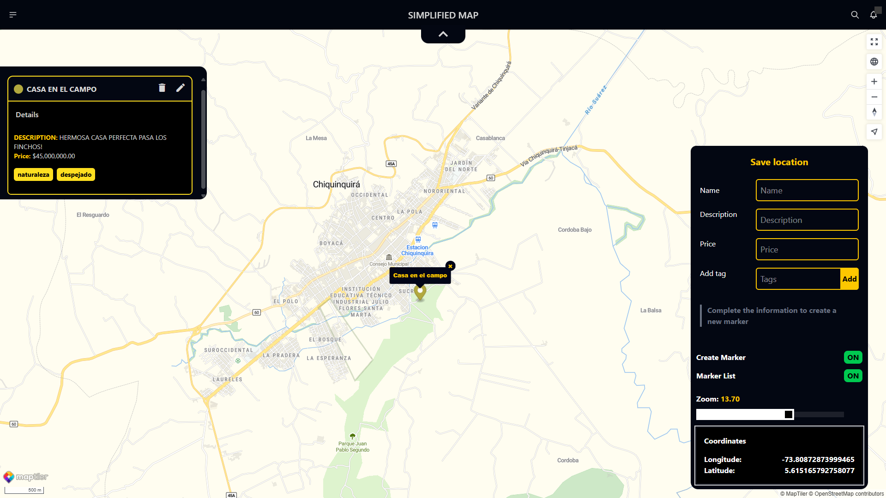

# Simplified Map

This project is a web application that allows users to create and manage their own locations.

Users can add markers, share locations and customize the appearance of their maps.

The application is built using Angular, Tailwind, DaisyUI and it utilizes the Maptiler Maps API for map functionality.

## Features

- Create and manage locations
- Add markers to locations
- Share locations with others
- Customize map appearance

## Interface



### Start the development server

- intall dependencies

```
npm install
```

- copy the file `.env.template` and create a `.env` file, add your secrets and build environment variables

- You can get a Maptiler api key here: https://cloud.maptiler.com/account/keys/

```
npm run set-env
```

- start the development server

```
ng serve
```
